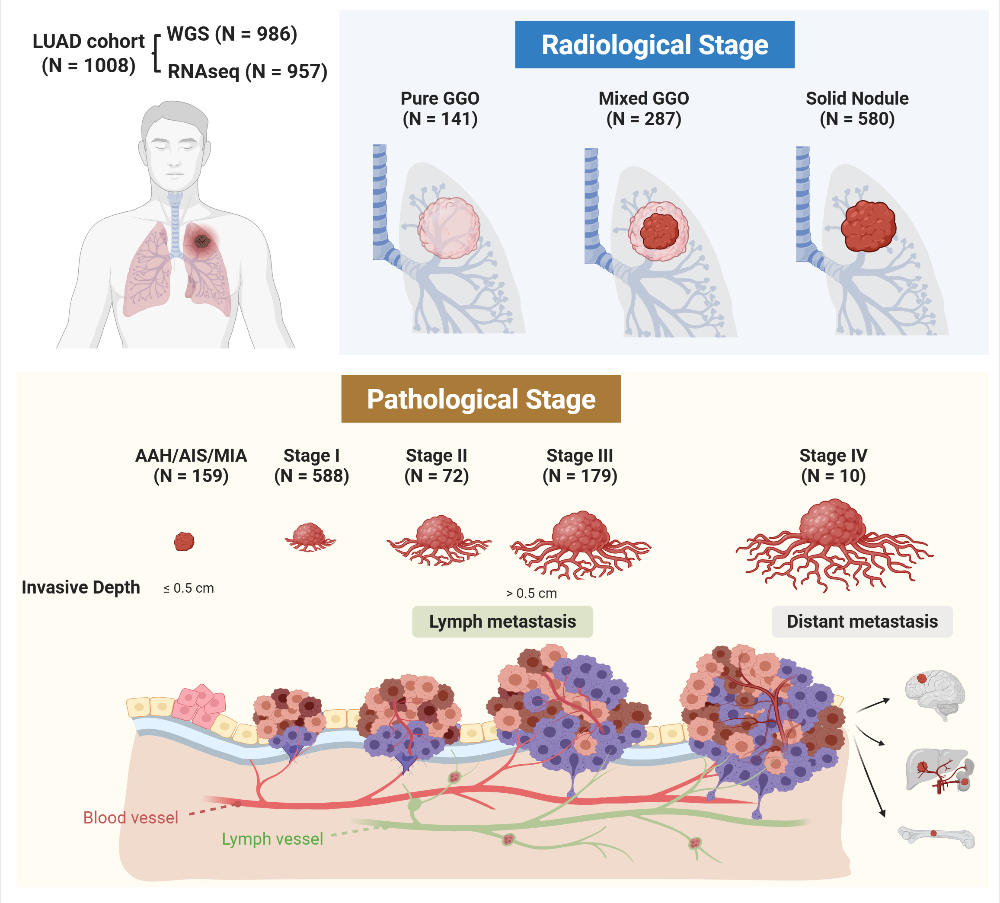

# GTLAD (Genomic and Transcriptomic Dynamics in the Stepwise Progression of Lung Adenocarcinoma)

> Yue Zhao, Jun Shang, Yueren Yan, He Jiang, Han Han et al. Genomic and Transcriptomic Dynamics in the Stepwise Progression of Lung Adenocarcinoma.

The dynamic genomic and transcriptomic changes underlying LUAD progression remain incompletely understood. Here we analysed genomic and transcriptomic profiles of 1,008 LUAD samples, encompassing all developmental stages in 954 patients, with comprehensive follow-up data. Frequently mutated driver genes were identified, with more mutations in tumor suppressor genes and higher levels of genomic instability observed as the disease progressed. Notably, MAP2K1 E102-I103 deletion was frequently identified in pre-invasive samples, which endowed Alveolar Type II (ATII) cells with increased growth potential and initiated tumor formation, suggesting it a potential driver mutation of LUAD. In summary, our study highlights key molecular changes in the stepwise progression of lung adenocarcinoma, provides insights into identifying novel therapeutic targets, and helps define the curative time window for this disease.

  

## Requirements

Tested on macOS Monterey (12.0.1). The data will be taken from the article's source data.

## Softwares used in this project

| Software                              | Version     | Link |
| :------------------------------------ | :---------- | :--- |
| FastQC                                | v0.11.9     |      |
| Fastq Screen                          | v0.15.1     |      |
| NGSCheckMate                          | v1.0.0      |      |
| sentieon-genomics (TNseq and TNScope) | 202112.04   |      |
| strelka2                              | v2.9.10     |      |
| ANNOVAR                               | v2019-10-24 |      |
| VEP                                   | v104.0      |      |
| SigProfilerExtractor                  | v1.1.21     |      |
| COSMIC                                | v3.3        |      |
| ascatNgs                              | v4.3.3      |      |
| ASCAT                                 | v2.5.1      |      |
| GISTIC2                               | v2.0.23     |      |
| cngpld                                | v0.1        |      |
| POLYSOLVER                            | v1.0.0      |      |
| GRIDSS2                               | v2.13.2     |      |
| FastP                                 | v0.36       |      |
| Hisat2                                | v2.2.1      |      |
| StringTie                             | v2.2.1      |      |
| STAR-Fusion                           | v1.6.0      |      |
| R                                     | v4.1.2      |      |
| limma                                 | v3.50.0     |      |
| GSVA                                  | v1.42.0     |      |
| survival                              | v3.2-13     |      |
| survminer                             | v0.4.9      |      |
| ComplexHeatmap                        | v2.15.4     |      |
| maftools                              | v2.10.05    |      |
| ggplot2                               | v3.4.0      |      |
| ggpubr                                | v0.4.0      |      |
